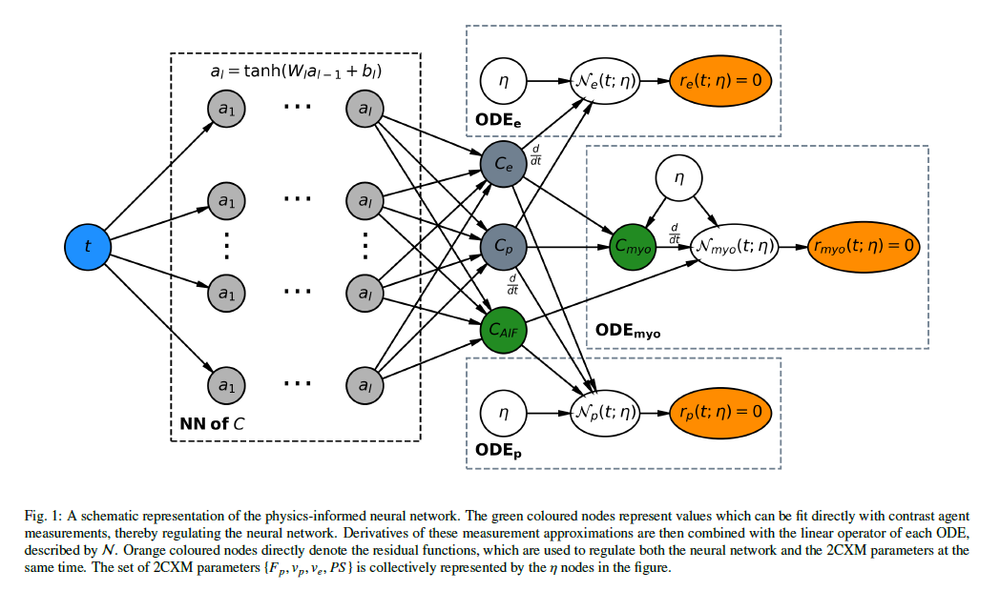

# myo_pinn
Tensorflow implementation of our paper (by Roel van Herten):

*Physics-informed neural networks for myocardial perfusion MRI quantification.* Rudolf L.M. van Herten, Amedeo Chiribiri, Marcel Breeuwer, Mitko Veta, and Cian M. Scannell.

If you find this code helpful in your research please cite the following paper:
```
@article{vanHerten2020pinn,
  title={Physics-informed neural networks for myocardial perfusion MRI quantification.},
  author={van Herten, Rudolf LM and Chiribiri, Amedeo, and Breeuwer, Marcel and Veta, Mitko and Scannell, Cian M},
  journal={arXiv preprint},
  year={2020}
}
```

# Methods overview 
This study introduces physics-informed neural networks (PINNs) as a means to perform myocardial perfusion MR quantification, which provides a versatile scheme for the inference of kinetic parameters. These neural networks can be trained to fit the observed perfusion MR data while respecting the underlying physical conservation laws described by a multi-compartment exchange model. Here, we provide a framework for the implementation of PINNs in myocardial perfusion MR.



# Environment setup
The code is implemented in Python 3.7 using the tensorflow2 library. Our anaconda environment can be replicated using the provided requirements.txt
```  
$ conda create --name myo_pinn --file requirements.txt
$ conda activate myo_pinn
```

# Running the code
`main_dro.py` can be run to reproduce the DRO study in Table 1 and plot Figure 2. `plot_patient_results.py` can be run to load the pre-trained weights for the patient data and to recreate the results in Table 2 and Figures 3, 4, and 5. The patient data is not available for ethical reasons. Fake placeholder data of the correct dimensions is provided to allow the correct initialisation of models for re-loading pre-trained weights.